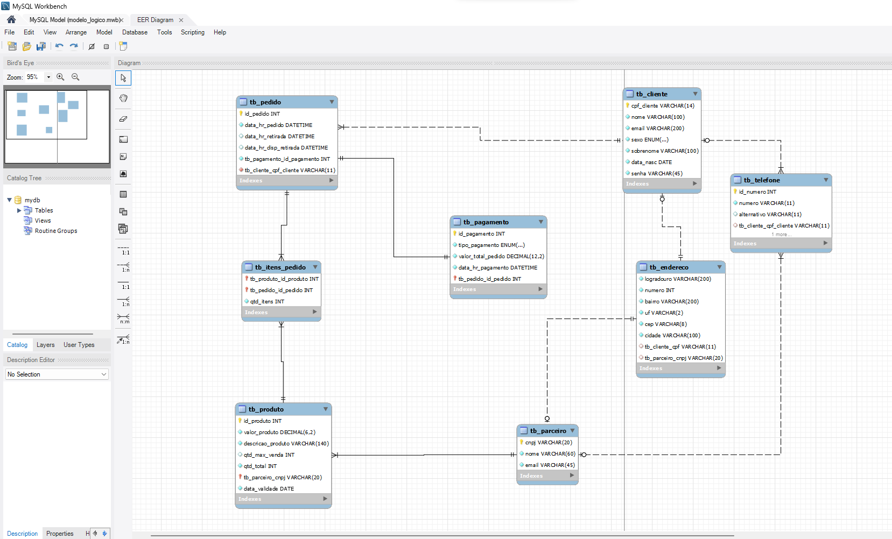
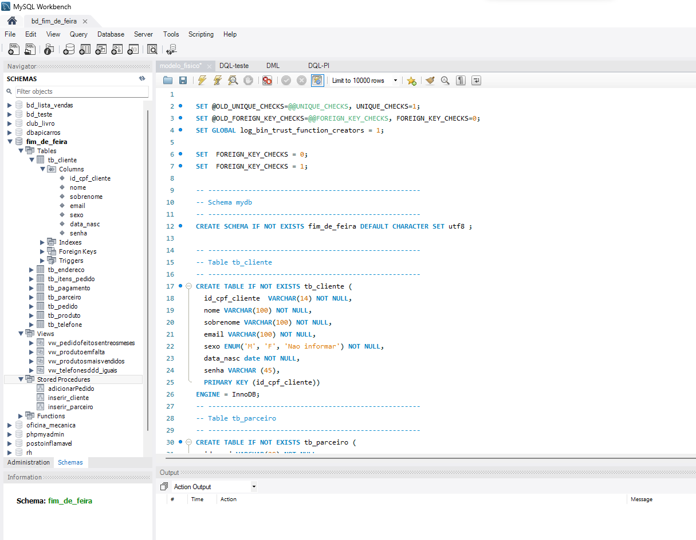

## 💻 Projeto

Um Banco de Dados de um site web, com Modelo Conceitual, Loógico e Físico. Neste caso, será usado o MySQL. Foi desafiador entender as necessidades do cliente, estabelecer os relacionamentos e aplicar as Formas Normais(FN).

## Modelo de negócio do cliente  

 
● Será criado uma aplicação web, como se fosse um marketplace. E será usado por 2 tipos de usuários: cliente e parceiro. Onde cada usuário(cliente) terá: um um cpf , nome, sobrenome, data de nascimento , endereço, email, senha e sexo. E cada usuário(parceiro) terá: cnpj, nome, email,telefone e endereço. 

● O cliente poderá realizar compras de produtos no app e essas compras só deverão conter itens de um único vendedor(parceiro) por pedido. 

● E cada usuário(parceiro) deverá cadastrar seus produtos onde esses produtos deverão possuir um código, descrição,data de validade, valor, quantidade máxima permitida para venda e quantidade total em estoque.  

● O pedido que será realizado pelo cliente deverá conter:valor,  código,data e hora do pedido, data e hora de disponibilidade para retirada, data e hora de retirada.  

● O produto será retirado pelo cliente após a confirmação do pagamento e esse pagamento possui: data e hora de pagamento, valor do pagamento,código, e um tipo de pagamento sendo crédito , débito ou pix. 

 

## Modelo Lógico  

 

## Modelo Físico  

 

## Tecnologia utilizada:

 
 

 

O projeto foi desenvolvido inicialmente com o br_Modelo e MySQL Workbench. Logo mais será inicido a codificão e implementação com o back-end da aplica.ção.

